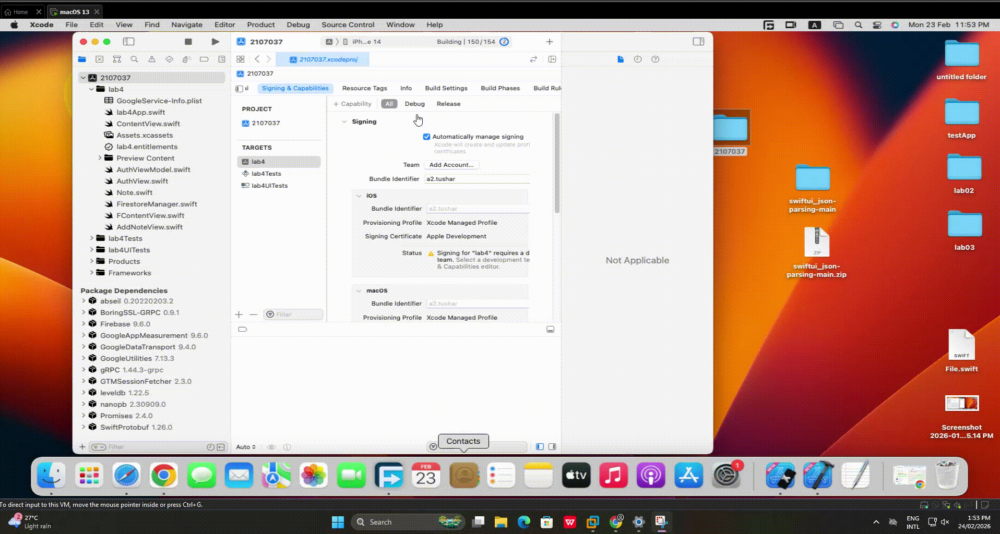

# 📝 Personal Notes App

A secure, user-friendly note-taking application built with SwiftUI and Firebase, offering a personalized and private note management experience.

## 📖 Project Overview

This is a cross-platform iOS/macOS note-taking application that leverages Firebase Authentication and Firestore to provide users with a completely isolated and secure environment for managing their personal notes. Each user's notes are stored independently in Firebase Firestore, ensuring complete privacy and data separation.

## ✨ Key Features

- 🔐 **Secure Authentication**: Email and password-based user authentication using Firebase Auth
- 📱 **User-Isolated Environment**: Each user has their own private note space - notes are never shared between users
- ➕ **Create Notes**: Add new notes with custom titles and content
- 📋 **View Notes**: Browse through all your notes in an organized list view
- 🗑️ **Delete Notes**: Remove unwanted notes with a simple button click
- ✏️ **Edit Notes**: Swipe actions for quick note editing
- 🔄 **Real-time Sync**: Notes are synchronized in real-time across devices using Firestore
- 🚪 **Sign Out**: Secure logout functionality to protect your data

## 🛠️ Technology Stack

- **Frontend**: SwiftUI
- **Backend**: Firebase
  - Firebase Authentication (User Management)
  - Cloud Firestore (Database)
- **Language**: Swift
- **Architecture**: MVVM (Model-View-ViewModel)

## 📹 Demo

### Quick Preview


### 🎥 Full Video Demo
[](https://drive.google.com/file/d/1VfW0Da14rfXLtt_SAOY4ZO4dCOjEN-LK/view?usp=sharing)

Click the button above to watch the complete demo video on Google Drive.

## 📸 Screenshots

<details>
<summary>Click to view all screenshots</summary>

### 1


### 2


### 3


### 4


### 5


### 6


### 7


### 8


</details>


## 🔑 Key Components

### Authentication System
- **AuthView**: Handles user sign-in and sign-up interface
- **AuthViewModel**: Manages authentication state and Firebase Auth operations

### Data Management
- **FirestoreManager**: Handles all Firestore CRUD operations
  - User-specific data isolation (`users/{uid}/notes`)
  - Real-time note synchronization
  - Secure data operations

### Models
- **Note**: Codable model with Firestore integration using `@DocumentID`

## 🚀 Getting Started

### Prerequisites
- Xcode
- macOS 13.0+
- Firebase account

### Installation

1. **Clone the repository**
   ```bash
   git clone https://github.com/TusharKumarRoy/swift_note_app/

   ```

2. **Configure Firebase**
   - Create a new Firebase project at [Firebase Console](https://console.firebase.google.com/)
   - Enable Email/Password authentication
   - Create a Cloud Firestore database
   - Download `GoogleService-Info.plist` and add it to the project

3. **Install Dependencies**
   - Open `2107037.xcodeproj` in Xcode

4. **Run the App**
   - Select your target device/simulator
   - Press `Cmd + R` to build and run

## 🔒 Privacy & Security

- **User Isolation**: Notes are stored in user-specific Firestore collections (`users/{uid}/notes`)
- **Secure Authentication**: Firebase Authentication handles password security
- **No Cross-User Access**: Users can only access their own notes
- **Real-time Security Rules**: Firestore security rules ensure data privacy


## 📝 License

This project was created for educational purposes.

## 🤝 Contributing

Contributions, issues, and feature requests are welcome!

---

**Student ID**: 2107037

Made with ❤️ using SwiftUI and Firebase
